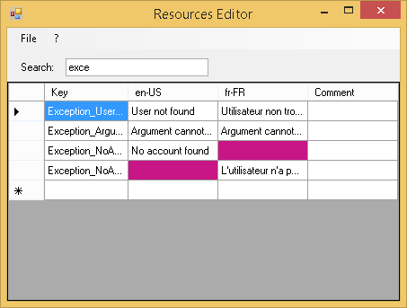

This tool give you a simplified way to edit your resources (ResX files) in combining all cultures in the same view.

# Points of interests

- Show all resources for all cultures in one view
- Colorize missing translations, so you can find them easily

# Limitations

- Works only with ResX files
- Cannot edit File Reference resources (Those resources are not shown but they are kept when saving)
